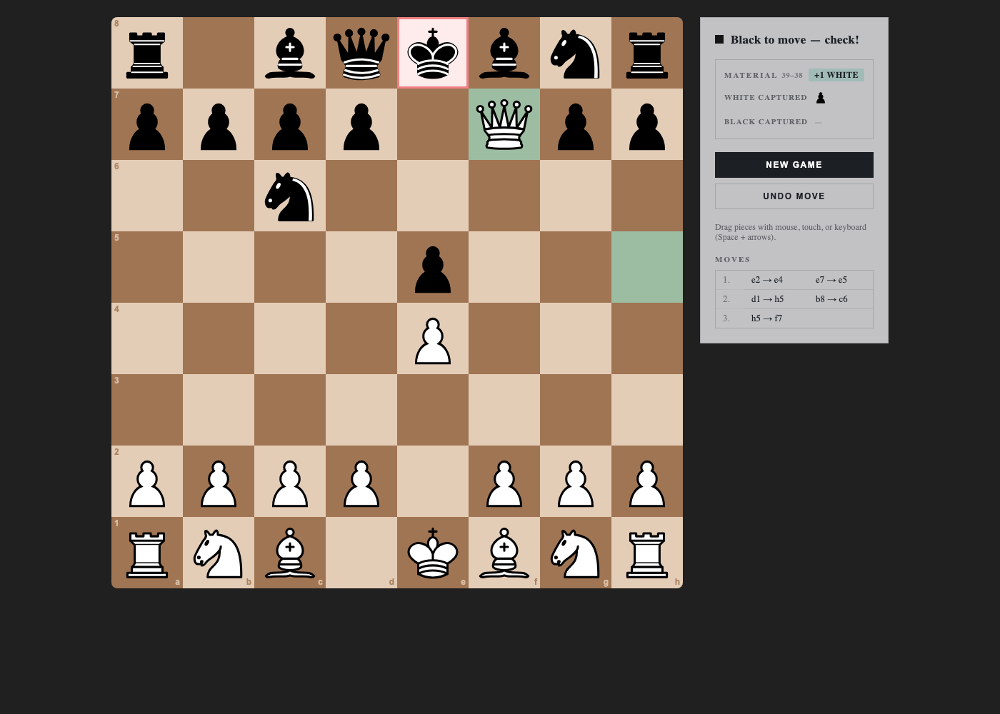

# Solid Chess

A fully playable chess app: local two-player and online multiplayer over WebSockets.
Framework-free rules engine, SolidJS UI with click and drag-and-drop input, strict
TypeScript, 95 tests.



## Features

- Complete rules: castling, en passant, promotion, check / checkmate / stalemate,
  fifty-move and insufficient-material draws
- Local hot-seat play and online rooms with shareable codes
- Server-side move validation — every networked move is re-checked by the engine
- Click-to-move with a sliding animation, pointer drag-and-drop, full keyboard play
- Material score with captured pieces, two-column move list, takebacks, resign flow,
  rematch with color swap
- Strict, keyboard-accessible UI (light and dark Radix palettes)

## Stack

- SolidJS 2, Vite 8, TypeScript in strict mode (no `any`)
- `@solid-primitives/drag-drop` pointer sensors
- Bun runtime: tests, dev server and the WebSocket game server
- Radix Colors, hand-rolled CSS — no component framework

## Quickstart

Requires [Bun](https://bun.sh) 1.x.

```sh
bun install
bun run dev        # client at http://localhost:5173
```

Online play needs the socket server (room codes are issued there):

```sh
bun run server     # ws://localhost:3001 (override with WS_PORT)
```

Point the client at another host when deploying separately:

```sh
VITE_WS_URL=ws://host:3001/ws bun run dev
```

## Checks

```sh
bun test           # engine unit tests + server unit/integration tests
bun run build      # tsc + static client + SSR bundle
```

## Architecture

The codebase is split along a single seam: pure logic versus reactive UI.

- `src/engine.ts` — dependency-free rules core: board model, pseudo/legal move
  generation, check detection, clocks, game status, material scoring and move
  detection from snapshots.
- `src/game-driver.ts` — the `GameDriver` interface (position, history,
  orientation, gating, status, submit). `GameView` renders any driver without
  knowing where the position comes from.
- `src/use-local-game.ts` / `src/use-online-game.ts` — the two drivers.
  Small focused hooks around them: `use-game-meta` (derivations),
  `use-move-input` (shared click + drag-and-drop orchestration),
  `use-fly-animation` (move slide overlay), `use-confirm`, `use-last-room`.
- `src/square-cell.tsx`, `src/menu-screen.tsx`, `src/piece-icon.tsx` —
  presentational components; `src/labels.ts` — all user-facing strings.
- `src/net-protocol.ts` — the shared client/server message contract.
- `server/rooms.ts` — pure room state machine (create/join/move/resign/rematch),
  unit-tested without sockets; `server/ws-server.ts` — thin Bun WebSocket transport.

## Testing

`bun test` runs 95 tests: engine rules (including fool's and scholar's mate, pins,
promotion, castling rights), rooms-reducer units, and full client↔server flows over
real sockets. UI flows (menu → game, click moves, room creation) are additionally
exercised in headless Chromium over CDP.

## Roadmap

- Threefold repetition and game clocks
- Bot opponent (minimax over the existing move generator)
- PGN export / import
- Mobile layout polish

## License

MIT
